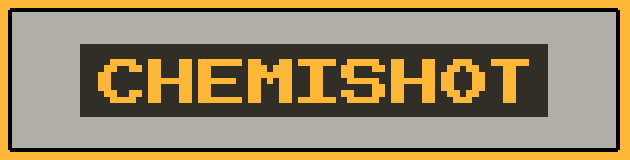
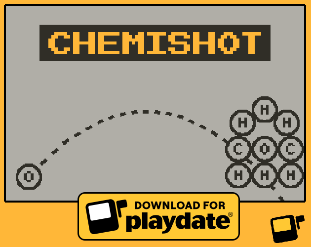

  

# ChemiShot

Transform learning chemistry and physics into a fun adventure with Playdate!

ChemiShot - Playdate game - EPFL BA6 SHS Video Games / Gamification

**Note**: check it out https://gruvw.itch.io/chemishot

ChemiShot was created by Jung Lucas, Kolly Florian, and Tredici Leonardo at EPFL in the HUM-380 course.

## Description

Dive into the fascinating worlds of **chemistry** and **physics** with **ChemiShot**, an educational and fun game developed for the **Playdate** console.

Inspired by the popular games **Angry Birds** and **Atomas**, ChemiShot combines the excitement of gaming with enriching scientific learning.
Take control of **atoms** and **shoot** them precisely to create molecules and destroy atom towers in this addictive game.
Collect every atom by completing **levels** and unlock new challenges as you progress.

## Music

The music used is "Agent 6", by Trevor Lentz: https://opengameart.org/content/agent-6
